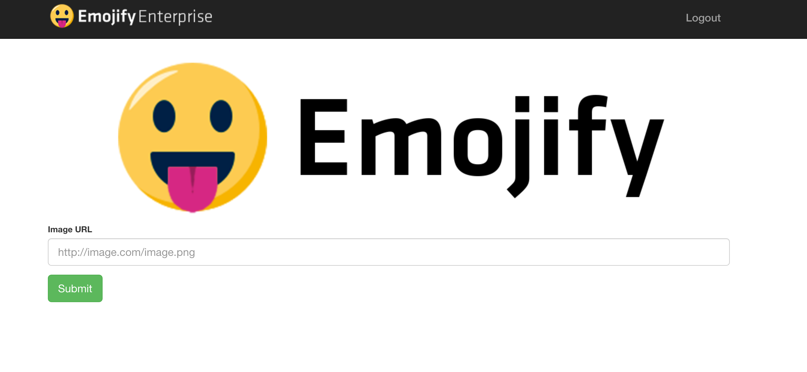

# Demo with Docker Compose
This simple demo runs the Emojify application with Docker Compose

## Prerequisites
- Docker and Docker Compose [https://www.docker.com/products/docker-desktop](https://www.docker.com/products/docker-desktop)
- MachineBox API key [https://machinebox.io/login?return_url=%2Faccount](https://machinebox.io/login?return_url=%2Faccount)

## Running
To run the demo first set your MachineBox API key as an environment variable

```bash
export MB_KEY=your_api_key
```

Then you can run `docker-compose up from this folder to start the demo

```bash
$ docker-compose up
Creating network "docker-compose_default" with the default driver
Creating docker-compose_emojify-api_1      ... done
Creating docker-compose_emojify-payments_1 ... done
Creating docker-compose_emojify-facebox_1  ... done
Creating docker-compose_consul_1           ... done
Creating docker-compose_emojify-auth_1           ... done
Creating docker-compose_emojify-website_1        ... done
Creating docker-compose_emojify-facebox-proxy_1  ... done
Creating docker-compose_consul-registrator_1     ... done
Creating docker-compose_emojify-api-proxy_1      ... done
Creating docker-compose_nginx_1                  ... done
Creating docker-compose_emojify-payments-proxy_1 ... done
Creating docker-compose_emojify-auth-proxy_1     ... done
Creating docker-compose_emojify-website-proxy_1  ... done
Creating docker-compose_nginx-proxy_1            ... done
```

The main website will now be accessible at `http://localhost:8181` and Consul is available at `http://localhost:8501`


